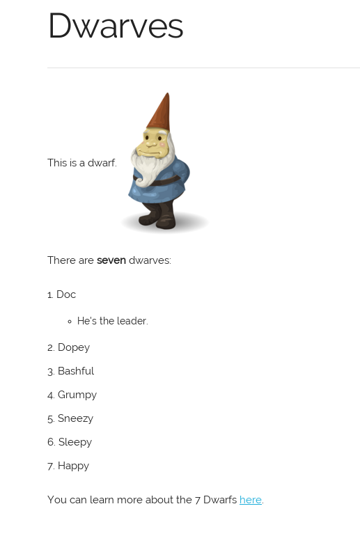

#  some-js {color(blue)tutorial}

- - -

{vspace(-3rem)}

## Intro

#### *some-js* has always set out to do three things well.

- Make writing websites from start to finish *//much faster//*
- Make common tasks possible through a specialised syntax bypassing
  the need for an expansive knowledge of HTML, CSS, JS
- Yet still allow people with this knowledge to use it.

#### This means that *you will*:

- *Save a tonne of time.* While not yet tested, I imagine that the time to
  learning *some-js* and writing a website in it will be around the same
  as to learn just HTML.
- Have a website that uses *best-practices* and still remains *modern* both
  in _functionality_ *and* in _appearance_.
- Your server has to send less data to the user so *hosting will be cheaper*
  and those with slower internet connections *will load quicker*.

    <input onclick="changePage('The How')" type="button" value="Go on...">

## The How

#### Easy. Some JavaScript Magic.

Effectively we redirect the whole way a web page is traditionally loaded
through an intermediary step. This intermediary step retrieves your some-js
file, turns it into the corresponding HTML, CSS and JS right on the users
computer.

#### But this is slow right?

Nope. The transformation step has been written in such a way as to
be //*lightning fast*//. And it comes with benefits that aren't traditionally
available. It means we can switch page, like you just did, much quicker than before.

The transformation step - the compiler - is so fast that it compiles between
key-presses in a view-as-you-type editor.

*In short, it's practically instant.*

    <input onclick="changePage('See the magic')" type="button" value="See the magic!">

## See the magic

#### This is what some-js looks like.

<pre><code class="hljs lang-markdown"># Dwarves
{-- Header --}

------------------------
{-- Horizontal rule --}

This is a dwarf. ![](https://goo.gl/YQKmvE)
{-- Text + an image --}

<style>
	img {
    	width: 130px;
        vertical-align: middle;
    }
</style>
{-- HTML tags can be included anywhere, like styling for the image --}

There are \*seven\* dwarves:
1. Doc
   - He's the leader.
2. Dopey
3. Bashful
4. Grumpy
5. Sneezy
6. Sleepy
7. Happy
{-- A list containing a list --}

You can learn more about the 7 Dwarfs [here](https://en.wikipedia.org/wiki/Seven_Dwarfs).
</code></pre>

#### That looks like [Markdown](https://daringfireball.net/projects/markdown/basics)?

Yup. It's Markdown with some major additions. The compiler used is [Marked](https://github.com/chjj/marked),
which is incredibly fast, and yet well featured, supporting 'Github Flavored Markdown', which
is what people use to write documentation on Github.

    <input onclick="changePage('See the Magic')" type="button" value="See the magic!">

